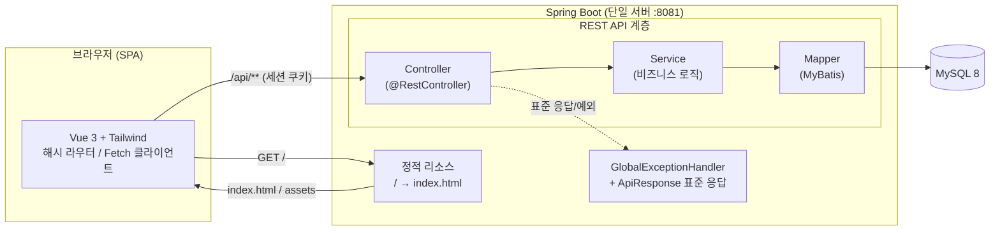
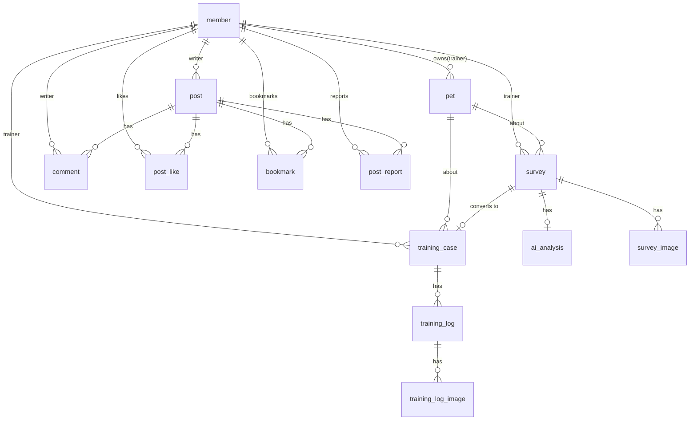

<div align="center">

# 🐾 PetLogs

**반려견 훈련사를 위한 케이스 · 훈련일지 · 사전문진 통합 관리 B2B SaaS**

보호자 상담부터 문제행동 진단, 회차별 훈련 기록, 훈련사 커뮤니티까지 —
흩어져 있던 훈련 업무를 하나의 워크스페이스로 모았습니다.

<br>


</div>

---

## 📑 목차

- [프로젝트 소개](#-프로젝트-소개)
- [핵심 기능](#-핵심-기능)
- [기술 스택](#-기술-스택)
- [시스템 아키텍처](#-시스템-아키텍처)
- [ERD](#-erd)
- [API 명세](#-api-명세)
- [프로젝트 구조](#-프로젝트-구조)
- [시작하기](#-시작하기)
- [기술적 의사결정](#-기술적-의사결정)
- [디자인 시스템](#-디자인-시스템)
- [문서](#-문서)
- [담당 역할](#-담당-역할)

---

## 📌 프로젝트 소개

전문 반려견 훈련사는 보호자 상담(카카오톡·전화), 문제행동 메모, 회차별 훈련 기록, 노하우 공유를
서로 다른 도구에 분산해 관리합니다. **PetLogs**는 이 과정을 하나의 흐름으로 통합합니다.

| 항목 | 내용 |
|---|---|
| 서비스 유형 | 반려견 훈련사 지원 B2B SaaS |
| 핵심 사용자 | 전문 훈련사 / 보호자(외부 문진) / 운영자 |
| 아키텍처 | REST API(Spring Boot) + SPA(Vue 3) — **단일 서버 정적 서빙** |
| 인증 방식 | 세션(HttpSession) 기반 |

#### 핵심 서비스 플로우
```
보호자 ──(문진 링크)──▶ 사전 문진 제출 ──▶ 훈련사 확인 ──▶ AI 행동 분석
                                                  │
                                                  ▼
                                    훈련 케이스 생성 ──▶ 회차별 훈련일지 기록
                                                  │
                                                  ▼
                                       훈련사 커뮤니티에 노하우 공유
```

---

## ✨ 핵심 기능

| 도메인 | 기능 |
|---|---|
| **인증** | 회원가입 · 세션 로그인/로그아웃 |
| **대시보드** | 전체/진행중 케이스, 미확인 문진, 이번 달 완료 등 핵심 지표 요약 |
| **사전 문진** | 보호자용 **외부 URL(토큰) 발급** → 비로그인 제출 → 훈련사 확인 → **AI 행동 분석** |
| **고객/케이스 관리** | 반려견·보호자 정보, 케이스 상태(접수→상담→훈련→완료) 관리 |
| **훈련일지** | 케이스별 회차 일지 CRUD, 전체 케이스 일지 **통합 아카이브 타임라인** |
| **커뮤니티** | 게시글 CRUD, 카테고리·검색·페이징, 좋아요/북마크/댓글/신고 |

---

## 🛠 기술 스택

**Backend**
- Java 17, Spring Boot 4.0.6 (Spring Web MVC)
- MyBatis (Mapper XML), MySQL 8
- springdoc-openapi (Swagger UI), Bean Validation, Lombok
- Maven (+ Maven Wrapper)

**Frontend**
- Vue 3 (CDN global build, 런타임 템플릿 컴파일)
- Tailwind CSS (Play CDN) + 커스텀 디자인 토큰
- 해시 기반 SPA 라우터(의존성 0), Fetch 기반 API 클라이언트

**Infra / Tooling**
- Spring Boot 정적 리소스로 프론트 동시 서빙(동일 출처 → 세션 쿠키 자동 전송, CORS 불필요)

---

## 🏗 시스템 아키텍처



3-tier(Controller → Service → Mapper) 구조에 도메인별 패키지(`auth`, `survey`, `training`, `community`, `dashboard`)로 분리했고,
모든 응답은 `ApiResponse<T>{ success, data, message }` 포맷으로 통일했습니다.

---

## 🗄 ERD



> 전체 DDL은 [`docs/schema.sql`](docs/schema.sql) 참고. (좋아요·북마크는 `post_id + member_id` UNIQUE 제약)

---

## 🔌 API 명세

> 서버 실행 후 **Swagger UI**: `http://localhost:8081/docs`

| 도메인 | Method & Path | 설명 |
|---|---|---|
| Auth | `POST /api/auth/signup` | 회원가입 |
| | `POST /api/auth/login` | 로그인(세션 생성) |
| | `POST /api/auth/logout` | 로그아웃 |
| Dashboard | `GET /api/dashboard` | 핵심 지표 + 최근 문진/케이스 |
| Survey | `POST /api/surveys/link` | 보호자 문진 링크(토큰) 생성 |
| | `POST /api/surveys/public/{token}` | 보호자 문진 제출 **(비인증)** |
| | `GET /api/surveys` · `GET /api/surveys/{id}` | 문진 목록 / 상세 |
| | `PATCH /api/surveys/{id}/confirm` | 확인 완료 처리 |
| | `POST /api/surveys/{id}/ai-analysis` | AI 행동 분석 요청 |
| Training | `GET·POST /api/training-cases` | 케이스 목록 / 생성 |
| | `GET /api/training-cases/{id}` | 케이스 상세 |
| | `PATCH /api/training-cases/{id}/status` | 케이스 상태 변경 |
| | `GET·POST /api/training-cases/{id}/logs` | 회차 일지 목록 / 작성 |
| | `PATCH·DELETE /api/training-logs/{id}` | 일지 수정 / 삭제 |
| Community | `GET·POST /api/posts` | 게시글 목록(페이징·검색) / 작성 |
| | `GET·PATCH·DELETE /api/posts/{id}` | 게시글 상세 / 수정 / 삭제 |
| | `POST /api/posts/{id}/likes` · `/bookmarks` | 좋아요 / 북마크 토글 |
| | `GET·POST /api/posts/{id}/comments` | 댓글 목록 / 작성 |
| | `POST /api/posts/{id}/reports` | 게시글 신고 |
| | `DELETE /api/comments/{id}` | 댓글 삭제 |

---

## 📁 프로젝트 구조

```
petlogs/
├── src/main/java/com/pettrainer/pro/
│   ├── auth/                 # 회원가입 · 로그인(세션)
│   ├── survey/               # 사전 문진 · AI 분석
│   ├── training/             # 훈련 케이스 · 회차 일지
│   ├── community/            # 게시글 · 댓글 · 좋아요/북마크/신고
│   ├── dashboard/            # 대시보드 집계
│   ├── member/ · pet/        # 공용 엔티티 · 매퍼
│   └── global/
│       ├── common/           # ApiResponse 표준 응답 래퍼
│       ├── config/           # WebMvcConfig · SwaggerConfig
│       └── exception/        # GlobalExceptionHandler · BusinessException
│   └── (각 도메인) controller / service / dto / entity / mapper
│
├── src/main/resources/
│   ├── mapper/               # MyBatis Mapper XML
│   ├── application.yml       # 환경변수 기반 설정 (DB_URL/USERNAME/PASSWORD)
│   └── static/               # ▼ 프론트엔드(SPA) — Spring Boot가 직접 서빙
│       ├── index.html
│       └── assets/           # theme/styles/api/app/router + views-*.js
│
├── docs/                     # 기획서 · 스키마 · 리팩터링/프론트 문서
├── pom.xml · mvnw · mvnw.cmd
└── README.md
```

---

## 🚀 시작하기

### 사전 요구사항
- JDK 17+
- MySQL 8 (실행 중인 인스턴스)

### 1) 데이터베이스 준비
```sql
CREATE DATABASE pettrainer DEFAULT CHARACTER SET utf8mb4;
-- 이후 docs/schema.sql 실행
```

### 2) 환경변수 설정 (선택 — 미설정 시 아래 기본값 사용)
| 변수 | 기본값 |
|---|---|
| `DB_URL` | `jdbc:mysql://localhost:3306/pettrainer?...` |
| `DB_USERNAME` | `ssafy` |
| `DB_PASSWORD` | `ssafy` |
| `SERVER_PORT` | `8081` |

```bash
# 예시 (macOS/Linux)
export DB_USERNAME=myuser
export DB_PASSWORD=mypassword
```

### 3) 실행
```bash
./mvnw spring-boot:run        # Windows: mvnw.cmd spring-boot:run
```

| 항목 | 주소 |
|---|---|
| 웹 앱 | http://localhost:8081/ |
| API 문서 (Swagger) | http://localhost:8081/docs |
| 테스트 계정 | `trainer1@test.com` / `1234` |

> 보호자 공개 문진 화면은 발급된 토큰으로 접근합니다: `http://localhost:8081/#/survey/{token}`

---

## 💡 기술적 의사결정

#### 1. JSP 혼재 구조 → 순수 REST API 리팩터링
초기 JSP 뷰 컨트롤러와 REST 컨트롤러가 혼재된 구조를, **백엔드는 JSON API에만 집중**하도록 정리했습니다.
- 응답을 `ResponseEntity<ApiResponse<T>>`로 표준화 (생성 `201 + Location`, 삭제 `204`)
- `Map` 기반 요청 본문을 **검증(DTO)** 으로 대체, 전역 예외 처리로 에러 포맷 일원화
- 상세 내역: [`docs/REST_REFACTORING.md`](docs/REST_REFACTORING.md)

#### 2. 프론트엔드를 정적 리소스로 백엔드에 병합
별도 노드 서버/빌드 파이프라인 없이 **Spring Boot 단일 서버**로 SPA를 서빙합니다.
- **동일 출처** → 세션 쿠키(JSESSIONID) 자동 전송, 별도 토큰 저장·CORS 설정 불필요
- 해시 라우팅으로 서버 측 포워딩 없이 모든 경로가 `index.html`로 귀결
- 상세 내역: [`docs/FRONTEND.md`](docs/FRONTEND.md)

#### 3. 설정 외부화
DB 접속 정보를 `application.yml`의 **환경변수 placeholder**로 분리해, 공개 저장소에 자격증명을 하드코딩하지 않으면서 로컬 기본값으로도 즉시 구동되도록 했습니다.

---

## 🎨 디자인 시스템

프로토타입 *"Professional Planner"* 디자인 언어를 그대로 구현했습니다.

- **무드**: 따뜻한 종이 질감의 B2B 워크스페이스(미니멀 + 촉각적)
- **컬러**: 무광 블루 `#3c5f7b`(주) · 딥 그린 `#45664b`(완료) · 테라코타 `#8d4937`(주의)
- **타이포**: Playfair Display(제목) + Inter(본문)
- **컴포넌트**: 폴라로이드 카드, 촉각적 그림자, 상태 태그, 플래너 탭

---

## 📚 문서

| 문서 | 내용 |
|---|---|
| [`docs/prd.md`](docs/prd.md) | 기획 및 요구사항 정의서 |
| [`docs/schema.sql`](docs/schema.sql) | 전체 DDL |
| [`docs/REST_REFACTORING.md`](docs/REST_REFACTORING.md) | REST 리팩터링 상세 |
| [`docs/FRONTEND.md`](docs/FRONTEND.md) | 프론트엔드 구조 및 화면↔API 매핑 |
| [`docs/ui_prototype.md`](docs/ui_prototype.md) | UI 프로토타입 정의 |

---

## 👤 담당 역할 

- **백엔드 API 설계 및 REST 리팩터링** — 도메인 패키지 구조, `ApiResponse` 표준화, 전역 예외 처리
합동 담당 : **DB 설계** — MyBatis 매퍼 및 스키마
팀원 1 : 프론트엔드 SPA 구현 — Vue 3 기반 화면 및 API 연동, 정적 서빙 통합 

---

<div align="center">

PetLogs · 2026

</div>
